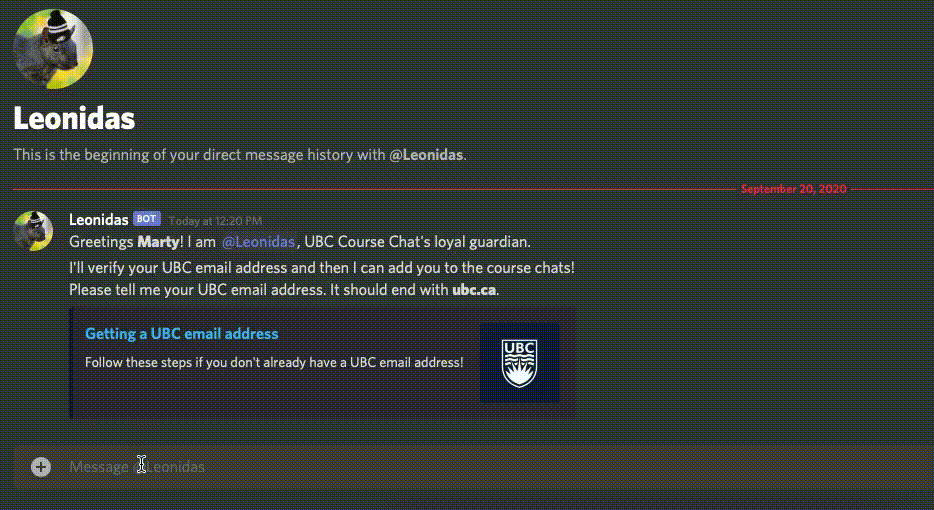

  

<h1 align="center">Leonidas</h1>

  

Leonidas is a Discord bot, created to make it easier for students to join group chats for their courses. It was designed to work for [UBC](http://ubc.ca) students and courses but could be easily extended to other universities. We noticed that students were posting in various Facebook groups asking to be added to group chats for their courses. They'd then have to wait for someone in one of their classes to happen accross their post and add them to a group chat.

Leonidas makes the process much simpler. Leonidas verifies that users (students, profs, TAs, etc.) have university-associated emails and then adds them to group chats for their requested courses automatically.

  

### The Problem

When we first launched Leonidas (and *[UBC Course Chat](https://discord.gg/Q5RcfhT)* over which he presides), he was creating chat channels for subject areas (e.g. CPSC), courses (e.g. CPSC 110), and sections (e.g. CPSC 110 101, CPSC 110 L12). We had a cool feature where users could drag and drop their course calendar files into their DMs with Leonidas and he would parse that and add them to their courses automatically (see [v1.0.0](https://github.com/bnwlkr/Leonidas/releases/tag/v1.0.0)). Within about an hour we learned that Discord has a 500-channel limit for servers. We hotfixed Leonidas so that he would only create course channels. The calendar-parsing feature was originally added so that users wouldn't have to tediously type out all of the sections, labs, waitlists, etc. that they were in. Since we started only creating course channels, we removed the calendar parsing feature to steamline things. 

We've been going steadily since then, but unfortunaly we are approaching the 500-channel limit again (455 at time of writing). The channel limit is lame - Discord should at least allow servers to 'upgrade' and increase the channel limit for a fee. Anyway, at some point within the next few days, Leonidas will no longer be able to create new course chat channels.

A potential solution would be to shard the course channels over different servers (perhaps one for each subject area), and then bridge those channels to servers containing the users. [This bot](https://top.gg/bot/683004822202351927) is a great tool for bridging channels between servers. There are a few issues with this solution (left as an exercise for the reader).

Regardless of what we decide to do with the *UBC Course Chat* server, Leonidas could be used on other Discord servers for email verification and/or automatic channel creation/assignment - please feel free!

### Planned Extensions
- add sharding to bypass 500-channel limit
- programmatically build the server
- add Python type suggestions
- add proper documentation
- add basic conversational abilities (something like [Dialogflow's Smalltalk](https://cloud.google.com/dialogflow/es/docs/agents-small-talk))
- add 'typing' indicator to make Leonidas seem more like a real squirrel (?)
- check if email really exists
- read messages received while offline on reboot
- improve access code email formatting
- add interesting commands (words of affirmation, useful class-related info)
- break up the `runleonidas.py:on_message` function and move things out of runleonidas.py
- turn on the linter and then fix all the issues (I didn't realize the linter wasn't on 😅)
- add some better analytics and email notifications if Leonidas goes down
- use Python MANIFEST.in for non-python build components
- automate server setup
- message unverified users on start up
- add better online handling of manual actions (e.g. manually verify a user without having to restart Leonidas)
